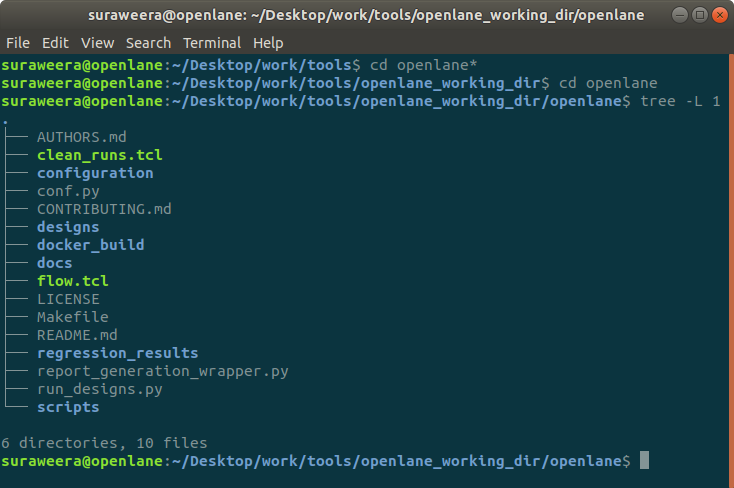
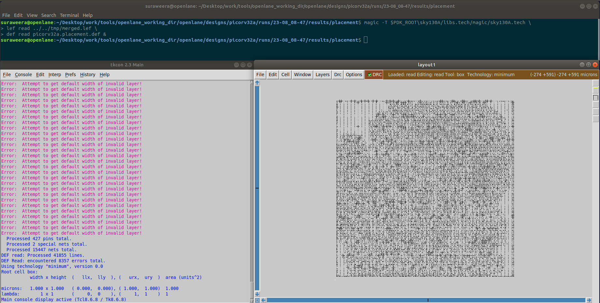

# [NASSCOM/VSD] Digital VLSI SoC Design and Planning
14-Days Workshop on VLSI SoC Design, Verilog RTL2GDSII, ASIC floor-planning, Standard-cell placement, SPICE simulations, Characterization, Signal integrity, Clock-tree synthesis, Power Distribution Network, and Physical design using Google/SkyWater SKY130A open-source Process Design Kit (PDK).

# Practicals

## Working Environment

- Ubuntu 18.04.6 LTS + Docker

- OpenLane v0.21 (as a *Docker* subsystem)

- Google/Skywater SKY130A PDK

  

> ⚠	The home folder name was set to *'vsduser'* in this environment.
>
> ⚠	The following symbolic links (SymLink) has been added in OS's `/.bashrc` to invoke the relevant docker environment quickly, and to PATH the PDK's root folder.

```
export PDK_ROOT = /home/vsduser/Desktop/work/tools/openlane_working_dir/pdks
alias docker = 'docker run 
					-it 
					-v 	$(pwd):/openLANE_flow 
					-v 	$PDK_ROOT:$PDK_ROOT 
					-e 	PDK_ROOT=$PDK_ROOT 
					-u 	$(id -u $USER):$(id -g $USER) efabless/openlane:v0.21'
```

### Directory structure:

*Folder tree up to three levels:*

```
suraweera@openlane:~/Desktop/work/tools$ tree -d -L 3
.
├── openlane_working_dir
│   ├── openlane
│   │   ├── configuration
│   │   ├── designs
│   │   ├── docker_build
│   │   ├── docs
│   │   ├── regression_results
│   │   └── scripts
│   └── pdks
│       ├── open_pdks
│       ├── sky130A
│       └── skywater-pdk
└── vsdflow
    ├── library
    ├── procs
    ├── verilog
    └── work
        └── tools

18 directories
```


----

## Practical 01: Design Synthesis

---

Working *OpenLane* directory is in `/openlane_working_dir/openlane`.

```
suraweera@openlane:~/Desktop/work/tools/openlane_working_dir/openlane$ tree -L 1.
├── AUTHORS.md
├── clean_runs.tcl
├── configuration
├── conf.py
├── CONTRIBUTING.md
├── designs
├── docker_build
├── docs
├── flow.tcl
├── LICENSE
├── Makefile
├── README.md
├── regression_results
├── report_generation_wrapper.py
├── run_designs.py
└── scripts

6 directories, 10 files
```



### Reference Design

*'PicoRV32a'* RISC-V core was chosen as the reference design for synthesis. The following file/folder tree depicts the configuration:

```
suraweera@openlane:~/Desktop/work/tools/openlane_working_dir/openlane/designs/picorv32a$ tree -L 1
.
├── config.tcl
├── runs
├── sky130A_sky130_fd_sc_hd_config.tcl
├── sky130A_sky130_fd_sc_hdll_config.tcl
├── sky130A_sky130_fd_sc_hs_config.tcl
├── sky130A_sky130_fd_sc_ls_config.tcl
├── sky130A_sky130_fd_sc_ms_config.tcl
└── src

2 directories, 6 files
```


### Invoking of OpenLane flow

Inside the *OpenLane* directory, the docker subsystem can be called via the previously-created 'SymLink' `docker`. 

The `flow.tcl` file contains an automated workflow. An interactive version can be invoked with the `-interactive` argument.

The imported *OpenLane* package version was 0.9. (Shall command: `% package require openlane 0.9`)

*'PicoRV32a'* reference design was selected using the shell command `% prep -design picorv32a`.

```
suraweera@openlane:~/Desktop/work/tools/openlane_working_dir/openlane$ docker
bash-4.2$ flow.tcl -interactive
[INFO]: 
	___   ____   ___  ____   _       ____  ____     ___
	/   \ |    \ /  _]|    \ | |     /    ||    \   /  _]
	|     ||  o  )  [_ |  _  || |    |  o  ||  _  | /  [_
	|  O  ||   _/    _]|  |  || |___ |     ||  |  ||    _]
	|     ||  | |   [_ |  |  ||     ||  _  ||  |  ||   [_
	\___/ |__| |_____||__|__||_____||__|__||__|__||_____|


[INFO]: Version: v0.21
[INFO]: Running interactively
% package require openlane 0.9
0.9
% prep -design picorv32a
[INFO]: Using design configuration at /openLANE_flow/designs/picorv32a/config.tcl
[INFO]: Sourcing Configurations from /openLANE_flow/designs/picorv32a/config.tcl
[INFO]: PDKs root directory: /home/vsduser/Desktop/work/tools/openlane_working_dir/pdks
[INFO]: PDK: sky130A
[INFO]: Setting PDKPATH to /home/vsduser/Desktop/work/tools/openlane_working_dir/pdks/sky130A
[INFO]: Standard Cell Library: sky130_fd_sc_hd
[INFO]: Sourcing Configurations from /openLANE_flow/designs/picorv32a/config.tcl
[INFO]: Current run directory is /openLANE_flow/designs/picorv32a/runs/20-08_09-39
[INFO]: Preparing LEF Files
[INFO]: Extracting the number of available metal layers from /home/vsduser/Desktop/work/tools/openlane_working_dir/pdks/sky130A/libs.ref/sky130_fd_sc_hd/techlef/sky130_fd_sc_hd.tlef
[INFO]: The number of available metal layers is 6
[INFO]: The available metal layers are li1 met1 met2 met3 met4 met5
[INFO]: Merging LEF Files...
mergeLef.py : Merging LEFs
sky130_fd_sc_hd.lef: SITEs matched found: 0
sky130_fd_sc_hd.lef: MACROs matched found: 437
sky130_ef_sc_hd__fill_12.lef: SITEs matched found: 0
sky130_ef_sc_hd__fill_12.lef: MACROs matched found: 1
sky130_ef_sc_hd__decap_12.lef: SITEs matched found: 0
sky130_ef_sc_hd__decap_12.lef: MACROs matched found: 1
sky130_ef_sc_hd__fakediode_2.lef: SITEs matched found: 0
sky130_ef_sc_hd__fakediode_2.lef: MACROs matched found: 1
mergeLef.py : Merging LEFs complete
[INFO]: Trimming Liberty...
[INFO]: Generating Exclude List...
[INFO]: Storing configs into config.tcl ...
[INFO]: Preparation complete
% 
```


### Design Synthesis

The shell command is `% run_synthesis`. Complete verbose log available [here](verbose/1.1.md).


#### Statistics:

```
28. Printing statistics.

=== picorv32a ===

   Number of wires:              14596
   Number of wire bits:          14978
   Number of public wires:        1565
   Number of public wire bits:    1947
   Number of memories:               0
   Number of memory bits:            0
   Number of processes:              0
   Number of cells:              14876
     sky130_fd_sc_hd__a2111o_2       1
     sky130_fd_sc_hd__a211o_2       35
     sky130_fd_sc_hd__a211oi_2      60
     sky130_fd_sc_hd__a21bo_2      149
     sky130_fd_sc_hd__a21boi_2       8
     sky130_fd_sc_hd__a21o_2        57
     sky130_fd_sc_hd__a21oi_2      244
     sky130_fd_sc_hd__a221o_2       86
     sky130_fd_sc_hd__a22o_2      1013
     sky130_fd_sc_hd__a2bb2o_2    1748
     sky130_fd_sc_hd__a2bb2oi_2     81
     sky130_fd_sc_hd__a311o_2        2
     sky130_fd_sc_hd__a31o_2        49
     sky130_fd_sc_hd__a31oi_2        7
     sky130_fd_sc_hd__a32o_2        46
     sky130_fd_sc_hd__a41o_2         1
     sky130_fd_sc_hd__and2_2       157
     sky130_fd_sc_hd__and3_2        58
     sky130_fd_sc_hd__and4_2       345
     sky130_fd_sc_hd__and4b_2        1
     sky130_fd_sc_hd__buf_1       1656
     sky130_fd_sc_hd__buf_2          8
     sky130_fd_sc_hd__conb_1        42
     sky130_fd_sc_hd__dfxtp_2     1613
     sky130_fd_sc_hd__inv_2       1615
     sky130_fd_sc_hd__mux2_1      1224
     sky130_fd_sc_hd__mux2_2         2
     sky130_fd_sc_hd__mux4_1       221
     sky130_fd_sc_hd__nand2_2       78
     sky130_fd_sc_hd__nor2_2       524
     sky130_fd_sc_hd__nor2b_2        1
     sky130_fd_sc_hd__nor3_2        42
     sky130_fd_sc_hd__nor4_2         1
     sky130_fd_sc_hd__o2111a_2       2
     sky130_fd_sc_hd__o211a_2       69
     sky130_fd_sc_hd__o211ai_2       6
     sky130_fd_sc_hd__o21a_2        54
     sky130_fd_sc_hd__o21ai_2      141
     sky130_fd_sc_hd__o21ba_2      209
     sky130_fd_sc_hd__o21bai_2       1
     sky130_fd_sc_hd__o221a_2      204
     sky130_fd_sc_hd__o221ai_2       7
     sky130_fd_sc_hd__o22a_2      1312
     sky130_fd_sc_hd__o22ai_2       59
     sky130_fd_sc_hd__o2bb2a_2     119
     sky130_fd_sc_hd__o2bb2ai_2     92
     sky130_fd_sc_hd__o311a_2        8
     sky130_fd_sc_hd__o31a_2        19
     sky130_fd_sc_hd__o31ai_2        1
     sky130_fd_sc_hd__o32a_2       109
     sky130_fd_sc_hd__o41a_2         2
     sky130_fd_sc_hd__or2_2       1088
     sky130_fd_sc_hd__or2b_2        25
     sky130_fd_sc_hd__or3_2         68
     sky130_fd_sc_hd__or3b_2         5
     sky130_fd_sc_hd__or4_2         93
     sky130_fd_sc_hd__or4b_2         6
     sky130_fd_sc_hd__or4bb_2        2

   Chip area for module '\picorv32a': 147712.918400
```

#### Static Timing Analysis:

```
OpenSTA 2.3.0 38b40303a8 Copyright (c) 2019, Parallax Software, Inc.
License GPLv3: GNU GPL version 3 <http://gnu.org/licenses/gpl.html>

This is free software, and you are free to change and redistribute it
under certain conditions; type `show_copying' for details. 
This program comes with ABSOLUTELY NO WARRANTY; for details type `show_warranty'.
Warning: /home/vsduser/Desktop/work/tools/openlane_working_dir/pdks/sky130A/libs.ref/sky130_fd_sc_hd/lib/sky130_fd_sc_hd__ff_n40C_1v95.lib line 31, default_operating_condition ff_n40C_1v95 not found.
Warning: /home/vsduser/Desktop/work/tools/openlane_working_dir/pdks/sky130A/libs.ref/sky130_fd_sc_hd/lib/sky130_fd_sc_hd__ss_100C_1v60.lib line 32, default_operating_condition ss_100C_1v60 not found.
create_clock [get_ports $::env(CLOCK_PORT)]  -name $::env(CLOCK_PORT)  -period $::env(CLOCK_PERIOD)
set input_delay_value [expr $::env(CLOCK_PERIOD) * $::env(IO_PCT)]
set output_delay_value [expr $::env(CLOCK_PERIOD) * $::env(IO_PCT)]
puts "\[INFO\]: Setting output delay to: $output_delay_value"
[INFO]: Setting output delay to: 4.946000000000001
puts "\[INFO\]: Setting input delay to: $input_delay_value"
[INFO]: Setting input delay to: 4.946000000000001
set_max_fanout $::env(SYNTH_MAX_FANOUT) [current_design]
set clk_indx [lsearch [all_inputs] [get_port $::env(CLOCK_PORT)]]
#set rst_indx [lsearch [all_inputs] [get_port resetn]]
set all_inputs_wo_clk [lreplace [all_inputs] $clk_indx $clk_indx]
#set all_inputs_wo_clk_rst [lreplace $all_inputs_wo_clk $rst_indx $rst_indx]
set all_inputs_wo_clk_rst $all_inputs_wo_clk
# correct resetn
set_input_delay $input_delay_value  -clock [get_clocks $::env(CLOCK_PORT)] $all_inputs_wo_clk_rst
#set_input_delay 0.0 -clock [get_clocks $::env(CLOCK_PORT)] {resetn}
set_output_delay $output_delay_value  -clock [get_clocks $::env(CLOCK_PORT)] [all_outputs]
# TODO set this as parameter
set_driving_cell -lib_cell $::env(SYNTH_DRIVING_CELL) -pin $::env(SYNTH_DRIVING_CELL_PIN) [all_inputs]
set cap_load [expr $::env(SYNTH_CAP_LOAD) / 1000.0]
puts "\[INFO\]: Setting load to: $cap_load"
[INFO]: Setting load to: 0.01765
set_load  $cap_load [all_outputs]
tns -759.46
wns -24.89
```

#### Utilization of FLOPS:

Number of FLOPS (`sky130_fd_sc_hd__dfxtp_2`) = 1613

Number of total cells = 14876

∴ FLOP Ratio:
$$
Ratio_{(FLOP)} = 1613/14876 = 0.1084296 = 10.843\%
$$


-----

## Practical 02: Floor Planning

---

### Configurations:

Shell command for the invoking of floor planning in the *OpenLane* `flow_tcl` script is `% run_floorplan`.

Before the run, floorplan parameters can be adjusted in script files located in several locations. The priority order for these parameter locations is:

1. PDK config (`/openlane_working_dir/openlane/designs/picorv32a/sky130A_sky130_fd_sc_hd_config.tcl`)
2. Standard config (`/openlane_working_dir/openlane/designs/picorv32a/config.tcl`)
3. Floorplan script configuration (`/openlane_working_dir/openlane/configuration/floorplan.tcl`).


For an example, in the following default configuration shown, core utilization `FP_CORE_UTIL` with be capped at 35% in the floorplan run.


The 'Readme' file (`/openlane_working_dir/openlane/configuration/README.md`) provides insights about these parameters. 

#### Floorplan Run:

The complete verbose log can be found [here](verbose/2.1.md).

Log excluding the warnings:

```
% run_floorplan
[INFO]: Running Floorplanning...
[INFO]: Running Initial Floorplanning...
[INFO]: current step index: 3
OpenROAD 0.9.0 1415572a73
This program is licensed under the BSD-3 license. See the LICENSE file for details.
Components of this program may be licensed under more restrictive licenses which must be honored.
Notice 0: Reading LEF file:  /openLANE_flow/designs/picorv32a/runs/23-08_05-28/tmp/merged_unpadded.lef
Notice 0:     Created 13 technology layers
Notice 0:     Created 25 technology vias
Notice 0:     Created 440 library cells
Notice 0: Finished LEF file:  /openLANE_flow/designs/picorv32a/runs/23-08_05-28/tmp/merged_unpadded.lef
[INFO IFP-0001] Added 238 rows of 1412 sites.
[INFO] Extracting DIE_AREA and CORE_AREA from the floorplan
[INFO] Floorplanned on a die area of 0.0 0.0 660.685 671.405 (microns). Saving to /openLANE_flow/designs/picorv32a/runs/23-08_05-28/reports/floorplan/3-verilog2def.die_area.rpt.
[INFO] Floorplanned on a core area of 5.52 10.88 655.04 658.24 (microns). Saving to /openLANE_flow/designs/picorv32a/runs/23-08_05-28/reports/floorplan/3-verilog2def.core_area.rpt.
[INFO]: Core area width: 649.52
[INFO]: Core area height: 647.36
[INFO]: Changing layout from 0 to /openLANE_flow/designs/picorv32a/runs/23-08_05-28/tmp/floorplan/3-verilog2def_openroad.def
[INFO]: Running IO Placement...
[INFO]: current step index: 4
OpenROAD 0.9.0 1415572a73
This program is licensed under the BSD-3 license. See the LICENSE file for details.
Components of this program may be licensed under more restrictive licenses which must be honored.
Notice 0: Reading LEF file:  /openLANE_flow/designs/picorv32a/runs/23-08_05-28/tmp/merged.lef
Notice 0:     Created 13 technology layers
Notice 0:     Created 25 technology vias
Notice 0:     Created 440 library cells
Notice 0: Finished LEF file:  /openLANE_flow/designs/picorv32a/runs/23-08_05-28/tmp/merged.lef
Notice 0: 
Reading DEF file: /openLANE_flow/designs/picorv32a/runs/23-08_05-28/tmp/floorplan/3-verilog2def_openroad.def
Notice 0: Design: picorv32a
Notice 0:     Created 409 pins.
Notice 0:     Created 14876 components and 115597 component-terminals.
Notice 0:     Created 14978 nets and 56051 connections.
Notice 0: Finished DEF file: /openLANE_flow/designs/picorv32a/runs/23-08_05-28/tmp/floorplan/3-verilog2def_openroad.def
#Macro blocks found: 0
Using 5u default boundaries offset
Random pin placement
RandomMode Even
[INFO]: Changing layout from /openLANE_flow/designs/picorv32a/runs/23-08_05-28/tmp/floorplan/3-verilog2def_openroad.def to /openLANE_flow/designs/picorv32a/runs/23-08_05-28/tmp/floorplan/4-ioPlacer.def
[INFO]: Running Tap/Decap Insertion...
[INFO]: current step index: 5
OpenROAD 0.9.0 1415572a73
This program is licensed under the BSD-3 license. See the LICENSE file for details.
Components of this program may be licensed under more restrictive licenses which must be honored.
Notice 0: Reading LEF file:  /openLANE_flow/designs/picorv32a/runs/23-08_05-28/tmp/merged_unpadded.lef
Notice 0:     Created 13 technology layers
Notice 0:     Created 25 technology vias
Notice 0:     Created 440 library cells
Notice 0: Finished LEF file:  /openLANE_flow/designs/picorv32a/runs/23-08_05-28/tmp/merged_unpadded.lef
Notice 0: 
Reading DEF file: /openLANE_flow/designs/picorv32a/runs/23-08_05-28/tmp/floorplan/4-ioPlacer.def
Notice 0: Design: picorv32a
Notice 0:     Created 409 pins.
Notice 0:     Created 14876 components and 115597 component-terminals.
Notice 0:     Created 14978 nets and 56051 connections.
Notice 0: Finished DEF file: /openLANE_flow/designs/picorv32a/runs/23-08_05-28/tmp/floorplan/4-ioPlacer.def
Step 1: Cut rows...
[INFO TAP-0001] Macro blocks found: 0
[INFO TAP-0002] #Original rows: 238
[INFO TAP-0003] #Cut rows: 0
Step 2: Insert endcaps...
[INFO TAP-0004] #Endcaps inserted: 476
Step 3: Insert tapcells...
[INFO TAP-0005] #Tapcells inserted: 5878
[INFO]: Changing layout from /openLANE_flow/designs/picorv32a/runs/23-08_05-28/tmp/floorplan/4-ioPlacer.def to /openLANE_flow/designs/picorv32a/runs/23-08_05-28/results/floorplan/picorv32a.floorplan.def
[INFO]: Taking a Screenshot of the Layout Using Klayout...
[INFO]: current step index: 6
Using Techfile: /home/vsduser/Desktop/work/tools/openlane_working_dir/pdks/sky130A/libs.tech/klayout/sky130A.lyt
Using layout file: /openLANE_flow/designs/picorv32a/runs/23-08_05-28/results/floorplan/picorv32a.floorplan.def
[INFO] Reading tech file: /home/vsduser/Desktop/work/tools/openlane_working_dir/pdks/sky130A/libs.tech/klayout/sky130A.lyt
[INFO] Reading Layout file: /openLANE_flow/designs/picorv32a/runs/23-08_05-28/results/floorplan/picorv32a.floorplan.def
[INFO] Writing out PNG screenshot '/openLANE_flow/designs/picorv32a/runs/23-08_05-28/results/floorplan/picorv32a.floorplan.def.png'
Done
[INFO]: Screenshot taken.
[INFO]: Power planning the following nets
[INFO]: Power: VPWR
[INFO]: Ground: VGND
[INFO]: Generating PDN...
[INFO]: current step index: 7
OpenROAD 0.9.0 1415572a73
This program is licensed under the BSD-3 license. See the LICENSE file for details.
Components of this program may be licensed under more restrictive licenses which must be honored.
Notice 0: Reading LEF file:  /openLANE_flow/designs/picorv32a/runs/23-08_05-28/tmp/merged_unpadded.lef
Notice 0:     Created 13 technology layers
Notice 0:     Created 25 technology vias
Notice 0:     Created 440 library cells
Notice 0: Finished LEF file:  /openLANE_flow/designs/picorv32a/runs/23-08_05-28/tmp/merged_unpadded.lef
Notice 0: 
Reading DEF file: /openLANE_flow/designs/picorv32a/runs/23-08_05-28/results/floorplan/picorv32a.floorplan.def
Notice 0: Design: picorv32a
Notice 0:     Created 409 pins.
Notice 0:     Created 21230 components and 129257 component-terminals.
Notice 0:     Created 14978 nets and 56051 connections.
Notice 0: Finished DEF file: /openLANE_flow/designs/picorv32a/runs/23-08_05-28/results/floorplan/picorv32a.floorplan.def
[INFO] [PDNG-0016] Power Delivery Network Generator: Generating PDN
[INFO] [PDNG-0016]   config: /home/vsduser/Desktop/work/tools/openlane_working_dir/pdks/sky130A/libs.tech/openlane/common_pdn.tcl
[INFO] [PDNG-0008] Design Name is picorv32a
[INFO] [PDNG-0009] Reading technology data
[INFO] [PDNG-0011] ****** INFO ******
Type: stdcell, grid
    Stdcell Rails
      Layer: met1 -  width: 0.480  pitch: 2.720  offset: 0.000 
    Straps
      Layer: met4 -  width: 1.600  pitch: 153.600  offset: 16.320 
      Layer: met5 -  width: 1.600  pitch: 153.180  offset: 16.650 
    Connect: {met4 met5} {met1 met4}
Type: macro, macro_1
    Macro orientation: R0 R180 MX MY R90 R270 MXR90 MYR90
    Straps
    Connect: {met4_PIN_ver met5}
[INFO] [PDNG-0012] **** END INFO ****
[INFO] [PDNG-0013] Inserting stdcell grid - grid
[INFO] [PDNG-0015] Writing to database
[INFO PSM-0026] Creating G matrix.
[INFO PSM-0028] Extracting power stripes on net VPWR.
[INFO PSM-0031] Number of nodes on net VPWR = 20600.
[INFO PSM-0037] G matrix created sucessfully.
[INFO PSM-0040] Connection between all PDN nodes established in net VPWR.
[INFO PSM-0026] Creating G matrix.
[INFO PSM-0028] Extracting power stripes on net VGND.
[INFO PSM-0031] Number of nodes on net VGND = 19223.
[INFO PSM-0037] G matrix created sucessfully.
[INFO PSM-0040] Connection between all PDN nodes established in net VGND.
[INFO]: PDN generation was successful.
[INFO]: Changing layout from /openLANE_flow/designs/picorv32a/runs/23-08_05-28/results/floorplan/picorv32a.floorplan.def to /openLANE_flow/designs/picorv32a/runs/23-08_05-28/tmp/floorplan/7-pdn.def
1
% 
```


#### Analysis:

> [INFO] Floorplanned on a die area of 0.0 0.0 660.685 671.405 (microns). 
> [INFO] Floorplanned on a core area of 5.52 10.88 655.04 658.24 (microns). 

In the default configuration, 1000 units = 1 micron.

According to the log, 

Die area = (660.685 - 0.0) x (671.405 - 0.0) = 443,587.212 µm² = 0.44359  mm²

Core area = (655.04 - 5.52) x (658.24 - 10.88) = 420,473.267 µm² = 0.42047 mm²


#### Visualization:

Inside the floorplan results folder relevant to the design run, 'MAGIC' tool must be invoked with the following arguments:

- PDK Tech file: `/openlane_working_dir/pdks/sky130A/libs.tech/magic/sky130A.tech`
- Runs LEF file: `../../tmp/merged.lef`
- Results DEF file: `picorv32a.floorplan.def`.

Command: 

`magic -T $PDK_ROOT/sky130A/libs.tech/magic/sky130A.tech \
lef read ../../tmp/merged.lef \
def read picorv32a.floorplan.def &`

```
suraweera@openlane:~/Desktop/work/tools/openlane_working_dir/openlane/designs/picorv32a/runs/23-08_05-28/results/floorplan$ magic -T $PDK_ROOT/sky130A/libs.tech/magic/sky130A.tech \
> lef read ../../tmp/merged.lef \
> def read picorv32a.floorplan.def
```


### Detailed Placement

> ⚠ Note: The remainder is demonstrated using a different run due to a unintended program interrupt.

*OpenLane* `flow.tcl` shell command for congestion-aware placement is `% run_placement`.

Complete verbose log available [here](verbose/2.2.md).

Highlights:

```
OpenROAD 0.9.0 1415572a73
This program is licensed under the BSD-3 license. See the LICENSE file for details.
Components of this program may be licensed under more restrictive licenses which must be honored.
Notice 0: Reading LEF file:  /openLANE_flow/designs/picorv32a/runs/23-08_08-47/tmp/merged_unpadded.lef
Notice 0:     Created 13 technology layers
Notice 0:     Created 25 technology vias
Notice 0:     Created 440 library cells
Notice 0: Finished LEF file:  /openLANE_flow/designs/picorv32a/runs/23-08_08-47/tmp/merged_unpadded.lef
Notice 0: 
Reading DEF file: /openLANE_flow/designs/picorv32a/runs/23-08_08-47/tmp/placement/8-resizer.def
Notice 0: Design: picorv32a
Notice 0:     Created 411 pins.
Notice 0:     Created 21699 components and 132071 component-terminals.
Notice 0:     Created 2 special nets and 0 connections.
Notice 0:     Created 15447 nets and 56989 connections.
Notice 0: Finished DEF file: /openLANE_flow/designs/picorv32a/runs/23-08_08-47/tmp/placement/8-resizer.def
Design Stats
--------------------------------
total instances         21699
multi row instances         0
fixed instances          6354
nets                    15449
design area          420473.3 u^2
fixed area             9141.3 u^2
movable area         147800.5 u^2
utilization                36 %
utilization padded         55 %
rows                      238
row height                2.7 u

Placement Analysis
--------------------------------
total displacement        0.0 u
average displacement      0.0 u
max displacement          0.0 u
original HPWL        766080.0 u
legalized HPWL       779196.5 u
delta HPWL                  2 %

[INFO DPL-0020] Mirrored 6193 instances
[INFO DPL-0021] HPWL before          779196.5 u
[INFO DPL-0022] HPWL after           766080.0 u
[INFO DPL-0023] HPWL delta               -1.7 %
```

#### Visualization:

Inside the placement results folder relevant to the design run, 'MAGIC' tool must be invoked with the following arguments:

- PDK Tech file: `/openlane_working_dir/pdks/sky130A/libs.tech/magic/sky130A.tech`
- Runs LEF file: `../../tmp/merged.lef`
- Placement DEF file: `picorv32a.placement.def`.

Command: 

`magic -T $PDK_ROOT\sky130A/libs.tech/magic/sky130A.tech \
lef read ../../tmp/merged.lef \
def read picorv32a.placement.def &`



---

⚠ Practicals on Characterization, SPICE simulation, CTS and PDN are in progress.

---

